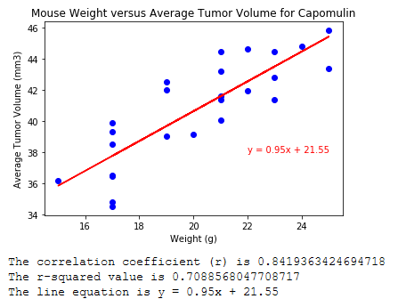

# Cancer Pharmaceutical Analysis

**Purpose**

Create a series of charts that illustrates the efficacy of various drugs in regard to reducing tumor growth. Present the rsults on HTML.

**Background**

Cancer has been one of the largest areas for research and drug discovery. Even promising new drugs discovered have many levels of testing to undergo before human trials.

**Additional Information**

Used Python for the general coding
Used HTML for the presentation
